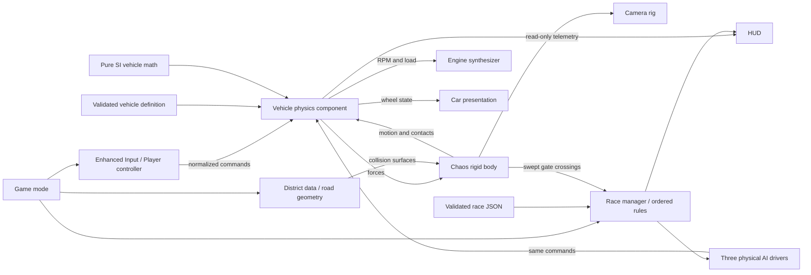

# VELOCITY AFTERDARK — technical direction

The Phase 1/2 implementation descriptions below preserve the original architectural baseline. Connected Phase 3–9 source, current contracts and explicit limits are documented in [Integrated systems](INTEGRATED_SYSTEMS.md). Implementation status is separate from the deferred runtime acceptance pass.

## Scope and identity

Build a driving game that rewards driving without a mission. Nova City is an original port metropolis: sodium-lit freight streets, restrained cold signage, glass towers, coastal expressways and dark mountain approaches. Cars and people are fictional. Neither reference-game assets nor licensed brands are shipped.

The 72-part specification is a product roadmap. Phase 1 provides one car, one district, controls, telemetry, camera and sound. Phase 2 builds a circuit race on that foundation. Traffic, career, weather simulation, customization and online services are subsequent gates. They are not represented by empty classes or menus. The larger first-playable milestone spans Phases 1–5; it is not synonymous with Phase 1.

Implementation target: Unreal Engine 5.8 on Windows x64, C++20. The verified development engine is UE 5.8.3. Source assets generate reproducibly through editor Python. Final art requires authored meshes, materials and recordings; generated geometry is a functional art blockout, not a completed AAA asset pass.

## Runtime ownership



## Physical contact and surface response

The player, traffic and race vehicles use the same Chaos-simulated chassis and four swept tire contacts. AI supplies normalized throttle, brake and steering commands; it does not place a racing car by directly changing its transform. The wheel query requests the contacted physical material and scales tire capacity from that surface's friction. Wetness then applies its own grip reduction. A shared profile table defines friction and low restitution for asphalt, concrete, markings, metal, water and other named materials; active road and structure collision batches receive their matching profiles.

The city uses simple collision proxies for roads, curbs and blocking structures. Most façade detail, street dressing and distant mesh instances stay non-colliding; enabling Chaos on every decorative mesh would multiply broadphase and streaming cost without improving driving. Retired or invalid AI vehicles are frozen and removed after leaving the active area to keep the nearby simulation bounded.

The pawn assembles components. Physics owns dynamic vehicle state; input does not set transforms. Camera, HUD and audio observe state and never award money or change vehicle performance. World geometry owns collision independently from decoration. Game mode owns world boot and player spawn. Transient wheel/contact buffers are fixed-size and reused.

Use Unreal delegates for semantic events when an actual second consumer exists: race started/finished, upgrade applied, pursuit state changed. Continuously sampled telemetry stays a typed snapshot, avoiding event spam. Do not make a global singleton service locator. Future persistent systems belong to game-instance subsystems; world-local simulations belong to world subsystems. Split modules when independent build dependencies warrant it, not one module per small class.

## Project layout

```text
VelocityAfterdark.uproject
Config/                         Engine, input, packaging, user defaults
Source/VelocityAfterdark/
  Public/Core/                  Engine-independent numerical model
  Public/Vehicle/               Definition, runtime vehicle component API
  Public/Player/                Pawn and command adapter
  Public/Presentation/          Camera/car/HUD interfaces
  Public/Audio/                 Synthesizer interface
  Public/World/                 District generation interface
  Public/Racing/                Race definition, director and physical AI driver
  Private/                      Implementations mirroring public domains
Content/Data/Vehicles/          Versioned vehicle source definitions
Content/Data/World/             District source layout
Content/Data/Tests/             Versioned driving benchmark route
Content/Data/Races/             Versioned circuit route, gates, grid and opponents
Content/Velocity/               Generated map/material .uassets, then authored assets
Scripts/Editor/                 Repeatable content bootstrap
Scripts/                       Build, source checks, test entry points
Tests/                         Portable numerical regressions
Docs/                          Architecture, assets, gates and evidence
```

`MyProject/`, if present, is a separate user-created Unreal project and is preserved. The game entry point is the root `VelocityAfterdark.uproject`.

`Private/Tests` contains editor automation plus opt-in runtime smoke/benchmark helpers. The benchmark is a bounded QA control producer with cached vehicle references and data-defined waypoints. Its initialization establishes controller → benchmark → physics tick order so ordinary player input cannot overwrite the recorded driving commands. Normal launches do not create the component, and Shipping launches cannot enable it. Phase 2 has a separate production racing driver; race automation attaches that driver to the QA player as well as the three opponents.

## Physics architecture

Coordinates are X forward, Y right, Z up. Unreal uses centimeters; all tire, spring, torque and aerodynamic calculations use meters, kilograms, seconds, Newtons and Newton-meters. Convert at the engine boundary: velocity cm/s × 0.01; force N × 100 to kg·cm/s². Avoid multiplying forces by frame delta before AddForce.

The chassis is one Chaos rigid body with simple box collision and CCD. Four wheel contact sweeps locate the road, ignoring the owning pawn. Each wheel derives suspension length and relative contact velocity. Spring force is stiffness × compression; damping opposes contact-normal velocity. Clamp normal load to a finite, nonnegative limit. Forces at wheel contact points generate pitch, roll and weight transfer. Rendered wheel centers follow the measured suspension.

Engine torque comes from the definition's RPM curve. Gear ratio, final drive, clutch/shift state and drivetrain efficiency convert torque into drive force. Automatic shifts use separate up/down thresholds and a cooldown; manual shifts respect available ratios. Reverse selection requires near-zero speed. Each wheel carries data-defined rotational inertia; an implicit slip-ratio solve couples drive/brake torque to longitudinal tire force while lateral slip and normal load share a friction circle. Wheelspin therefore raises engine RPM and animated wheel speed instead of discarding excess drive demand. Brake/low-speed regularization must not add energy. Drag opposes velocity; downforce grows with speed squared. RWD/FWD/AWD allocation is a definition property.

The vehicle remains a simplified SIMCADE force model: no full tire carcass model, thermodynamics, deformable contact patch, unsprung wheel rigid bodies, detailed clutch inertia, complex differential or damage. The implicit contact calculation is an improvement to this model, not a substitute for the fixed-step physics-thread integration gate below. Assists are bounded force controls. Treat changes to tires, torque and mass as measured handling changes, not cosmetic stats.

Chaos substeps are configured to at most 1/120 s with 12 substeps. **Contact queries and force requests run on the game thread before physics. They are not recalculated per solver substep.** Time-scaled calculations do not establish frame-rate invariance of the coupled car. Compare 30/60/120 FPS before tuning is accepted. If limits fail, move contact generation and force evaluation to an engine-supported physics-thread simulation callback with cached input and explicit world-query ownership. Do not call game-thread UObject APIs from an arbitrary physics callback. Epic documents that force requests are maintained across internal substeps: [physics substepping](https://dev.epicgames.com/documentation/en-us/unreal-engine/physics-sub-stepping-in-unreal-engine).

Keep the math tests when swapping the rigid-body integration adapter. A future authored skeletal vehicle may use [Chaos Vehicles](https://dev.epicgames.com/documentation/unreal-engine/chaos-vehicles), but its handling must pass the same maneuvers before replacement. There is no untested parallel vehicle implementation in this repository.

## Data contracts

Vehicle definitions have stable IDs, schema version, manufacturer/name/class, mass, torque samples, idle/redline RPM, ordered forward ratios, reverse ratio, final drive, wheel geometry and inertia, drivetrain, suspension, tires, brakes, steering and aero. Validate finiteness, range, nonzero denominators, sorted curve RPMs and gear bounds before enabling physics. Invalid required content produces a visible/logged startup failure instead of a silent default vehicle. Definitions are immutable after loading; runtime state is separate.

JSON is the initial reviewable source of truth, packaged as Unreal UFS data. An eventual editor importer may generate PrimaryDataAssets while preserving IDs and validation. Do not maintain JSON and hand-edited DataAssets as competing authorities. Future soft asset references resolve through Asset Manager bundles (drive, showroom, cockpit, audio) and async loading. Hot-swapping vehicle definitions during an active simulation is out of scope.

Future contracts are designs, not shipped code:

| Definition | Essential data and authority |
|---|---|
| Upgrade | ID, slots, compatibility, price, performance deltas, visual/audio asset IDs; validate before purchase |
| Tuning | Version, vehicle ID, bounds per parameter, named presets; clamp at load and server |
| Race | ID, directed road-edge route, checkpoint gates, rule type, class eligibility, entry cost, rewards |
| District | Stable node/edge IDs, lane topology, surface ID, crew control, streaming cells, unlock conditions |
| Driver | Personality weights, reaction delay, risk, car/tune, braking limits; same car physics as player |
| Career | Prerequisite graph of wins/REP/discoveries/crew state; no blanket level-only locks |
| Save | Schema version, generation, payload, checksum, previous verified generation; migrations tested |

Save writes in Phase 3 will use a temp file, validate readback, then replace primary while retaining a backup. Detect truncation/schema mismatch and recover without granting currency twice. Local checksums detect corruption, not cheating. Credits and rewards use integral values and idempotent transaction IDs. Profile settings are separate from career state.

## World architecture

Phase 1's Dockside sector is a bounded static test district: 3.9 km of centerline roads, warehouse blocks, skyline and roadside props. Intersections are actual geometry connections; it is not 3.9 km of unique race route. Geometry is grouped by mesh/material using hierarchical instances, with decorative culling and simple collision. Static world generation happens once; no every-frame building creation. No active traffic, pedestrian AI, weather or open-world streaming is claimed here.

Phase 6 replaces the bounded runtime generator with authored World Partition cells, One File Per Actor and HLOD layers. Author roads as directed lane splines plus junction priority/traffic-light metadata. Separate collision, road lane navigation, scenery and distant skyline. Use surface physical materials for asphalt, concrete, gravel, grass, dirt, metal, mud and painted lines. Roads and their collision must be resident ahead of the fastest car; size lookahead by speed × measured streaming latency plus braking margin.

Use approximately 256 m cells as a starting experiment, not an assumed optimum. Stream high-detail car interiors and world materials by distance, view and memory budget. HLOD substitutes distant geometry; it is not collision. Preload destination cells before fast travel; fail safely if loading fails. Keep a global low-cost road graph available for routes while cell-specific actors stream. See Epic's [World Partition overview](https://dev.epicgames.com/documentation/en-us/unreal-engine/world-partition-in-unreal-engine).

Expansion districts: Downtown (technical streets), Iron Quay industrial area, Glass Coast, Vesper mountain roads, Northfield countryside, Sable desert and Nova Motorsport Park. Each needs distinct road rhythm, materials and landmarks. Maintain drive time and biome continuity instead of attaching seven disconnected themed rooms.

## Rendering and audio direction

PBR material parameters separate paint, metal, rubber, glass and emissive lamps. Fixed nighttime lighting establishes composition in Phase 1. The wet-looking road material is an art setting, not a dynamic moisture or rainfall simulation. The detected development GPU is a GeForce 940MX with 2GB VRAM, so startup uses DX11/SM5, conventional shadows and screen-space reflections. Lumen/virtual shadows need a separate validated DX12/SM6 configuration on capable hardware. Nanite, hardware ray tracing, frame generation and upscalers are only claimed once their specific assets/platform integrations are validated.

Warm streetlights and cold fill separate the vehicle silhouette. Limit overlapping local lights and shadow casters; real lights should carry illumination and emissive geometry should establish readable sources. The chase camera uses collision and a bounded FOV response, with a stable horizon and no compulsory vibration. Cockpit fidelity and mirrors have separate budgets.

Original synthesized engine layers establish RPM/load feedback without third-party recordings. This proves connection and lifecycle, not final engine timbre. Recorded intake/exhaust/load/coast layers, tire surfaces, transients, occlusion and tunnel sends replace synthesis incrementally after licensed source acquisition. Music/radio are later systems, with a manifest containing origin, license and streamer-safe eligibility per track.

## Phase 2 race ownership

`AADRaceManager`, owned by the game mode, loads one immutable `FADRaceDefinition` from JSON. It owns Idle → Countdown → Racing → Results, spawned opponents, per-racer state and cached classification order. Player finish opens Results while remaining opponents continue; the board explicitly labels provisional results. Timeout retires unfinished cars. Leaving or restarting destroys old opponents and unbinds recovery delegates. No economy or reward transaction exists yet.

`ADRaceRules::Progress` is the engine-independent timing and checkpoint core, used directly by the manager. It tests movement segments against finite directed gates, interpolates crossing time, enforces gate order and rejects discontinuous motion. Every lap requires the start line and all seven gates in order. Simulation time advances after GO and pauses with the world. Finish time includes the grid run-up; lap times begin at the first start-line crossing. Recovery adds the configured penalty, resets only the movement sample, and invalidates the current best-lap candidate without awarding gates or laps. Ranking between gates is restricted to the unlocked route section, so another nearby road cannot grant unearned progress.

`UADRaceDriverComponent` runs before the same physics component used by the player. Pure-pursuit steering follows a speed-annotated route; anticipated braking, lane following, relative-speed following and clear-lane passing use ordinary throttle/brake/steering. Three cached obstacle sweeps run at 10 Hz; competitor references are cached when the grid is created. Difficulty scales planned pace, without extra torque or player-relative catch-up. Bounded brake/reverse/forward maneuvers attempt physical recovery before the manager can apply an explicit penalized reset. This is a first circuit driver, not the final personality, defensive racing or general road-network planner.

Drivers initially hold their actual grid lane until a safe merge is available; following gaps consistently compare chassis centers. Finished opponents continue a bounded run-out through ordinary controls, capped at 60 km/h, then brake. This clears the timing line for remaining racers while their recorded result remains fixed. Leaving/restarting stops and destroys those drivers as part of the same race ownership lifecycle.

The controller binds race commands and reads the manager's input gate; HUD and markers observe race state. The manager evaluates motion after physics. NPC paint and distance-attenuated engine audio distinguish the three cars. JSON loading validates route length, ordered gates, grid spacing, strict numeric types and driver settings before enabling the event. Failed data keeps free driving available with a visible race diagnostic.

The Phase 2 race is local and authority-guarded. Authority checks do not supply replication, network clock synchronization or anti-cheat. Those remain Phase 9 integration work.

## Future police systems

Later police use patrol → pursuing → lost sight → searching → escaped/busted, with explicit transitions. Detection needs line of sight and observer knowledge, not omniscient position. An incident coordinator assigns interception sectors, finite roadblocks and search areas. Heat escalation is driven by authored policy and evidence. Safehouses work only after required pursuit conditions. Pedestrians remain in protected scenery areas and are not collision targets.

## Career and original narrative plan

The opening arrival is implemented as a real-time, multi-shot camera sequence at the wet freight viaduct; the authored chapter dialogue and recurring rivals are in the career catalog. Local mechanic Mara Venn is referenced as the player's introduction, not a continuous mission dispenser. Technical driver Ivo Renn values clean wins; coastal rival Sel Arden puts her reputation behind the player. Bounded rival memory stores encounters, wins/losses, respect and grudge, and can change their briefing/victory context. The current slice has no bespoke voice or character models.

Original crew working names: Night Serpents (technical city racing), Signal Red (highway pace), Obsidian Run (exotics), Iron Wolves (drag) and Ghost Circuit (touge). Leaders and chapter identities now exist in the authored career data; territories, bespoke driving identities/vehicles, fuller relationships and race conditions remain planned. Names need a release clearance pass; no real logos or copyrighted character art are included.

Progression goes Unknown → Street Racer → Challenger → Crew Hunter → Professional → Elite → Legend → Afterdark Champion. Credits buy cars and parts; REP earns invitations. Rewards combine wins, skill chains, exploration and crew outcomes. Prototype economy in a spreadsheet and simulate starter-to-upgrade time before authoring hundreds of prices. No pay-to-win systems.

## Multiplayer boundary

Phase 1 is local single player. No replication claim is made. Future commands are sequenced, timestamped throttle/brake/steer/gear requests, validated and rate-limited by an authoritative server. Server simulates competitive rules, checkpoints, race times and results. Clients interpolate remote state and reconcile local prediction; physics is not assumed deterministic across machines. Test loss, jitter, divergence and abuse before public sessions.

Only the server can commit credits, unlocks, results and leaderboards. Signed result IDs and idempotent rewards prevent replays. Keep matchmaking/platform IDs behind an adapter, credentials out of game clients, and dedicated-server code free of rendering/audio dependencies. Social services, shared liveries and moderation enter Phase 9 only after offline rules are stable.
